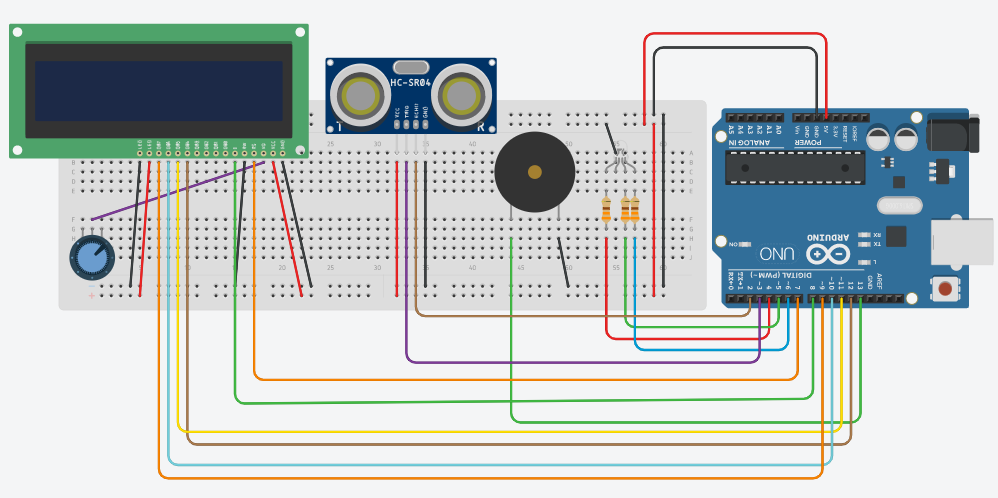

# What is it?
Arduino Parking Sensor works just like a parking sensor in the car - it beeps faster and changes the color depending on the distance between an object and ultrasonic sensor.

# How does it work?
Ultrasonic sensor's (HC-SR04) Trigger pin sends a signal which bounces off an object, which next gets received by Echo pin as a time, counted from time of sending to receiving signal.

# How can I build it?
If you want to build it, you would need:
1. Arduino
1. Some wires
1. Breadboards
1. LCD screen
1. Buzzer
1. RGB diode
1. HC-SR04 ultrasonic sensor

Circuit for this project (circuit created with [Tinkercad](https://tinkercad.com)):

